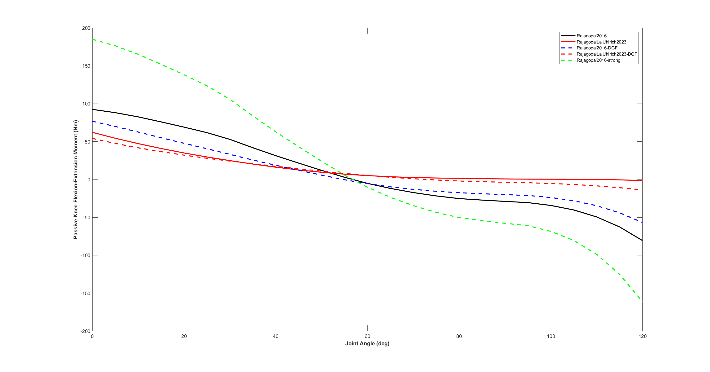
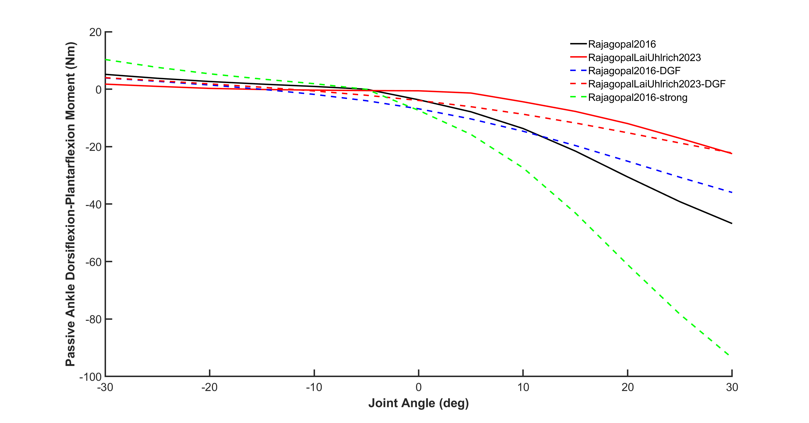
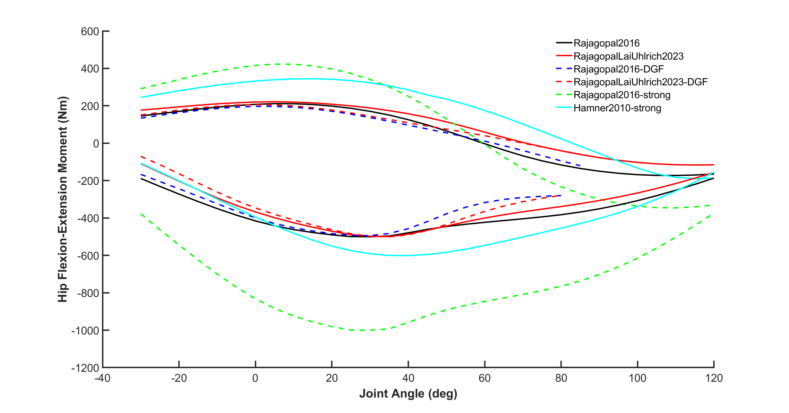
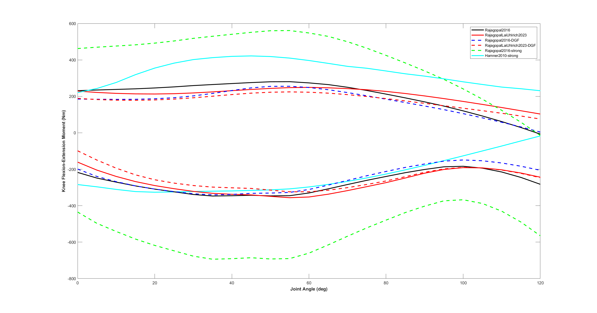
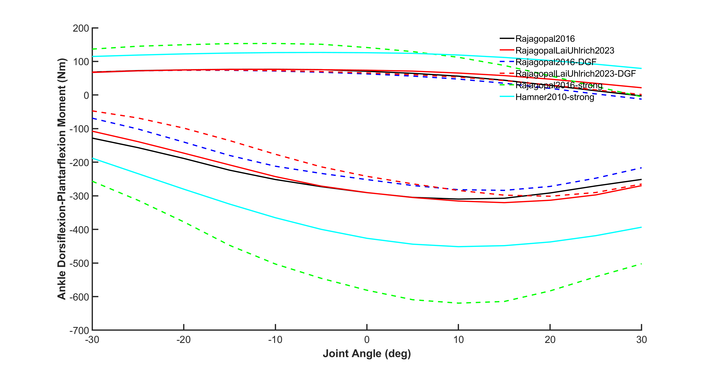

# model_personalization

As it stands this repository ***cannot*** currently help you to personalize your musculoskeletal model muscle-tendon parameters, but this is the goal in the near future.

This repository currently serves to document the ***passive joint moments*** and ***maximum isometric joint moments*** for commonly used OpenSim models:
- Rajagopal2016
- RajagopalLaiUhlrich2023
- Rajagopal2016 with DeGrooteFregly2016 muscles (Rajagopal2016-DGF)
- RajagopalLaiUhlrich2023 with DeGrooteFregly2016 muscles (RajagopalLaiUhlrich2023-DGF)
- Rajagopal2016 with the maximum isometric force parameters doubled (Rajagopal2016-strong)
- Hamner2010 with the maximum isometric force parameters doubled (Hamner2010-strong)

The passive joint moments based on the experimental work of Riener and Edrich (1999) have also been included (RienerEdrich1999).

# Determining passive joint moments and maximum isometric joint moments

To calculate the passive and maximum isometric joint moments curves we followed the procedures described in the Supplementary Figure 3 caption of Rajagopal et al. (2016):
> Hip flexion-extension moments were computed  with the knee fixed at 10deg flexion. Knee flexion-extension moments were computed with the hip fixed at 70deg of flexion. Ankle dorsiflexion-plantarflexion moments were computed with the knee fixed at 80deg flexion. In each case, unspecified joint angles were fixed at 0deg. Passive joint moments for the hip, knee and ankle were calculated by summing the passive moments produced by all muscles crossing the respective joint (equilibrating muscles with activation set to lowest possible value). Active joint moments were computed for hip, knee and ankle flexion and extension by summing the maximum isometric moment produced by all agonists and the passive moment produced by the antagonist muscles (equilibrating with activation of agonists set to 1; antagonists set to lowest possible value).

# References
1. Rajagopal, A., Dembia, C.L., DeMers, M.S., Delp, D.D., Hicks, J.L. & Delp, S.L. (2016). Full-body musculoskeletal model for muscle-driven simulation of human gait. IEEE Transactions on Biomedical Engineering, 63, 2068-2079. 
2. Riener, R. & Edrich, T. (1999). Identification of passive elastic joint moments in the lower extremities. Journal of Biomechanics, 32, 539-544.

# Passive hip moments

# Passive knee moments

# Passive ankle moments

# Active-Passive hip moments

# Active-Passive knee moments

# Active-Passive ankle moments
