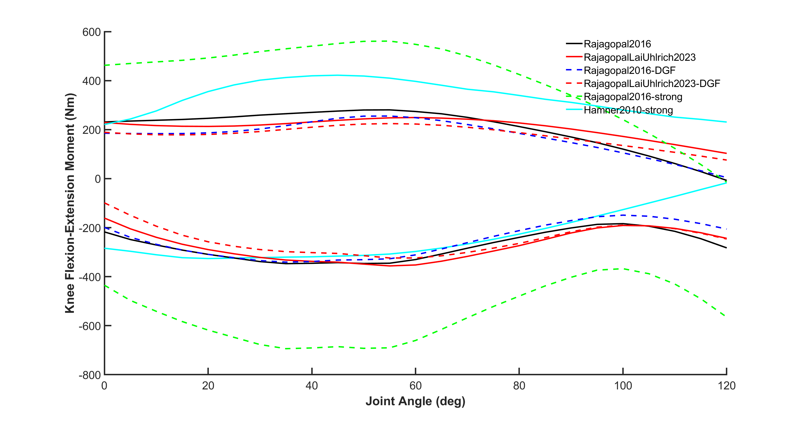

# model_personalization

As it stands this repository ***cannot*** currently help you to personalize your musculoskeletal model muscle-tendon parameters

# Passive hip moments

# Passive knee moments

# Passive ankle moments

# Active-Passive hip moments

# Active-Passive knee moments

# Active-Passive ankle moments
