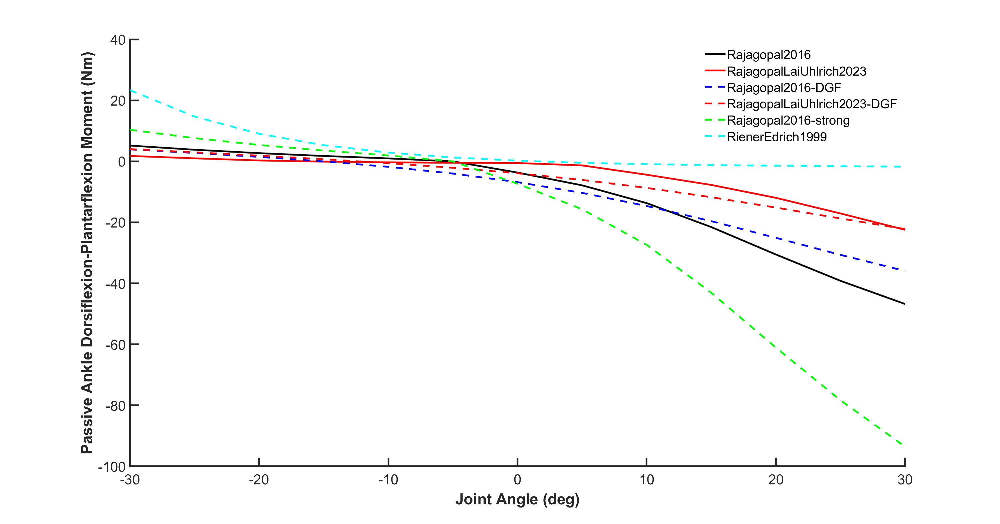

# model_personalization

As it stands this repository ***cannot*** currently help you to personalize your musculoskeletal model muscle-tendon parameters, but this is the goal in the near future.

This repository currently serves to document the ***passive joint moments*** and ***maximum isometric joint moments*** for commonly used OpenSim models:
- Rajagopal2016
- RajagopalLaiUhlrich2023
- Rajagopal2016 with DeGrooteFregly2016 muscles (Rajagopal2016-DGF)
- RajagopalLaiUhlrich2023 with DeGrooteFregly2016 muscles (RajagopalLaiUhlrich2023-DGF)
- Rajagopal2016 with the maximum isometric force parameters doubled (Rajagopal2016-strong)
- Hamner2010 with the maximum isometric force parameters doubled (Hamner2010-strong)

The passive joint moments based on the experimental work of Riener and Edrich (1999) have also been included (RienerEdrich1999).

# Determining passive joint moments and maximum isometric joint moments

To calculate the passive and maximum isometric joint moments curves we followed the procedures described in the Supplementary Figure 3 caption of Rajagopal et al. (2016):

# References
1. 
2. 

# Passive hip moments

# Passive knee moments

# Passive ankle moments

# Active-Passive hip moments

# Active-Passive knee moments

# Active-Passive ankle moments
